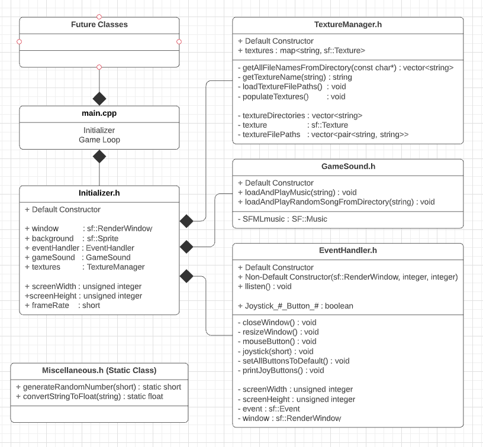

DESCRIPTION:
    This repository is a framework for making a card game in C++ using SFML. This framework contains
    the necessary classes to load playing card images, manage textures, set sound and music, access
    and use mouse and joystick controls, and several other various functions like generating random
    numbers and reading files from folders.

DEPENDENCIES:
    C++ 11,
    SFML (Get it here: https://www.sfml-dev.org/index.php)

COMPILE INSTRUCTIONS (CMake):

    1.) Create build folder (if doesnt exist). 
    2.) cd into build folder.
    3.) Run command: "cmake .." (auto config) or "ccmake .." (manual config) 
    	If manual, configure anything needed but you should only need to add "Debug" to the 1 blank. 
        Hit "c" to create crap. If it works, a "g" option will appear to generate and exit.
    4.) Run command: "make" This will create a "Main.out" executable in the source folder.

    Note: Only step 4 will be needed for repeat compiles once the Build folder is created and 
    initialized. There are also scripts to assist with compiling and cleaning garbadge files.

COMPILE INSTRUCTIONS (g++):
    If CMake isnt working, you can use the 'compileAndRun.bash' script. Run as is. 
    

